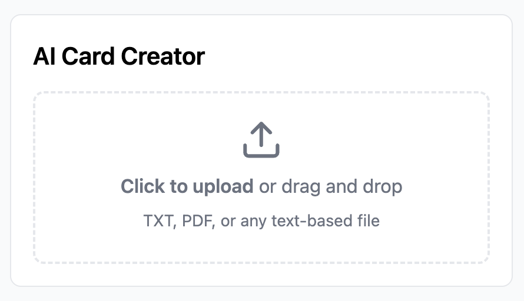
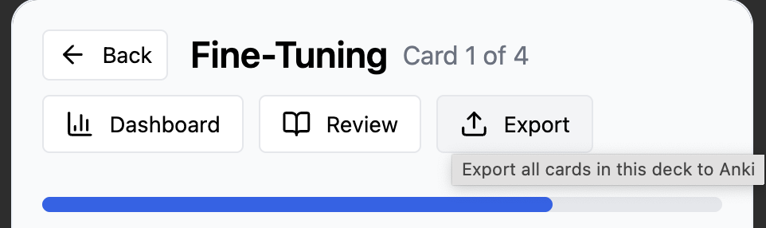
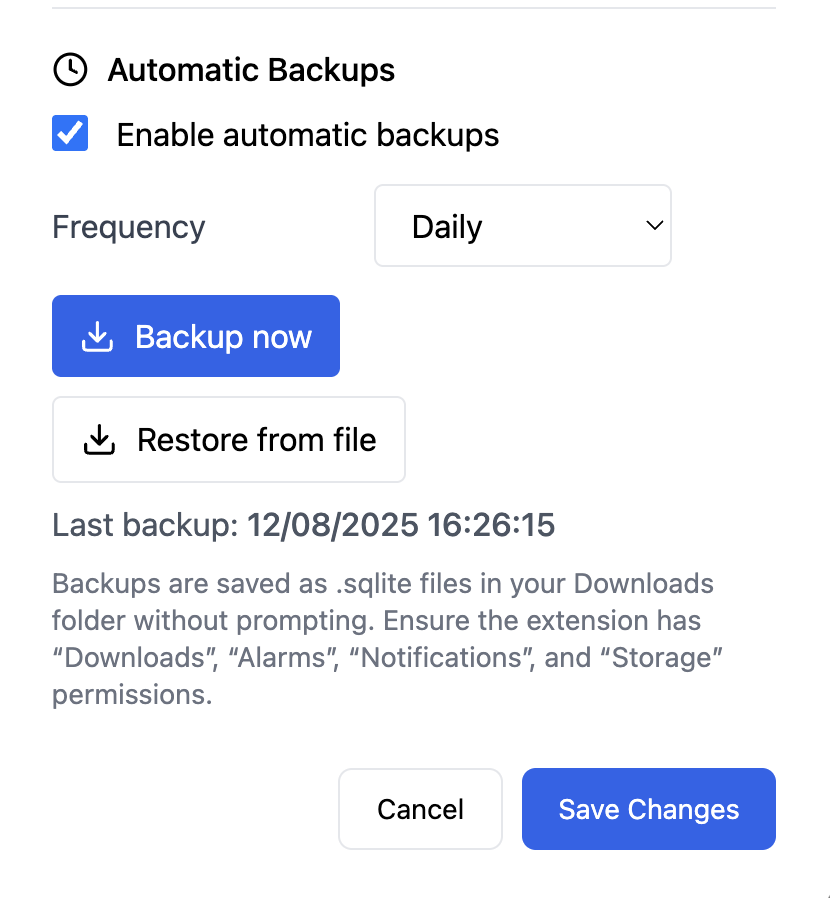

# Smart Anki Flashcard Extension
Turn anything you read into powerful, AI-powered flashcards — right in your browser.

⚡ Learn Faster. Forget Less.
Highlight, click, remember — it’s that simple. AI-powered flashcards, 100% private, and yours for life.

## Overview
Local-first, privacy-focused, AI-powered Chrome extension to create, learn, and export spaced-repetition flashcards. Clean UI, zero cloud lock-in, bring your own AI key to keep costs low.

## Why you’ll love it (No code)
### Feature-rich
- ✍️ Turn any page into spaced‑repetition flashcards with AI: highlight text on the web, paste notes, or upload PDFs. 

- ⚡ Quick and easy: Always available with one click on your browser

- 🧠 Learn faster: keyboard-first review flow with clear Easy/Good/Again actions for spaced-repetition learning

- 🖼️ Visual memory: attach images to cards for better recall

- 🎮 Beautiful gamified dashboard to make learning addictivie. Track sessions, streaks, and deck progress to stay motivated. Clean, minimal analytics baked into the learning flow.

### Cheap and private

- 🔒 Truly private: your data stays in your browser (no accounts, no servers)
- 💵 Cheap: use your own AI API key! Pay for what you use only

### Clean UI and easy to use

- 🚀 60-second setup: import once, pin, set your shortcut, and start creating cards from any page
1. Go to chrome://extensions/
2. Select `Load unpacked`
1. Upload dist folder

🚀 DONE! Enjoy it?🚀 Get it [here.](https://chloemade.gumroad.com/l/bestaiankiflashcardchromeextension)

### Sharable on your terms
- ↗️ Take your decks anywhere: export to Anki when you’re ready

### Customizable
- Adjust accessibility however you want. Pick your AI provider. Did I mention use AI-powered card generations for free (with Gemini API)?
- Adjustable text size for comfortable reading (75–150%).

- 🥷 Learn like a pro. Customize your hotkeys so you can use shortcut to quickly navigate.

### And other cool features
- 💾 Safe by default: automatic backups to your Downloads folder (one toggle)

## Demo
### Adding new card with AI

- You can add images to any cards.
- AI-generated cards from selection are automatically addeed to the current study deck you have open, or ask you to select a deck if you're on the home page.

### Learning progress dashboard

### Full demo

## Highlights

- 🔒 Local-first: all data stored in the browser via SQLite (sql.js) — no servers, no telemetry
- ✨ AI-powered card generation from selected text or uploaded files (BYO API key)
- 🎮 Gamified dashboard to track daily streaks and progress
- ↗️ Export to Anki (single card or full deck) with sensible fallbacks
- ⌨️ Keyboard-first learning flow: Easy / Good / Again hotkeys
- 💾 Automatic, silent backups to Downloads with restore-from-file
- 📚 Side Panel UI that works across any website
- 🌐 Robust selection capture via Chrome Scripting API; works on any site
- 🧠 AI provider profiles with BYO keys (OpenAI, Gemini), configurable in Settings
- 🧰 Deck management: create, rename, and organize decks from the side panel
- 🎯 Toolbar badge feedback on key actions
- 🔤 Adjustable text size (75–150%) persisted locally
- 🚫 Strict CSP and permission scoping; only connects to AI providers you enable
- 🧩 Clean React + Tailwind + TypeScript codebase, ready to extend

## Install & Use (No code)

Follow these steps to import the extension into Chrome and start using it.

1) Get the files  
   - If you received a zipped build: unzip it. Inside you should have a folder with a prebuilt dist/ or the project folder.  
   - If you’re building yourself, see Build & Ship below to produce dist/.

2) Load the extension  
   - Open Chrome and go to chrome://extensions  
   - Toggle “Developer mode” ON (top-right)  
   - Click “Load unpacked” and select the dist/ directory

3) Pin the extension  
   - Click the puzzle icon (Extensions) in the toolbar and pin Smart Anki Flashcard Extension

4) Assign shortcuts  
   - Go to chrome://extensions/shortcuts and set your preferred keys (defaults below)

5) Enable silent backups (optional but recommended)  
   - Go to chrome://settings/downloads and toggle OFF “Ask where to save each file before downloading”

6) Use it  
   - Highlight text on any page → press Create Cards shortcut → choose deck → review cards  
   - Open the Side Panel from the toolbar button to manage decks, learn, or open Settings

## Technical details
### Automatic backups
- Enable scheduled backups and use “Backup now” from Options or the Side Panel Settings.
- Service Worker: [arrayBufferToBase64()](src/scripts/service-worker/service-worker.ts:123), [performBackup()](src/scripts/service-worker/service-worker.ts:151)
- UI actions: [handleBackupNow()](src/scripts/options/Options.tsx:78), [handleBackupNow()](src/scripts/sidepanel/SettingsDialog.tsx:179), [handleRestoreFile()](src/scripts/sidepanel/SettingsDialog.tsx:207)

### Privacy-first
- Data never leaves your browser. Database lives in IndexedDB via sql.js. See [src/utils/sqlite.ts](src/utils/sqlite.ts)

### Customize in Settings

Implementation references:
- Backup SW: [performBackup()](src/scripts/service-worker/service-worker.ts:151), [arrayBufferToBase64()](src/scripts/service-worker/service-worker.ts:123)
- UI actions: [handleBackupNow()](src/scripts/options/Options.tsx:78), [handleBackupNow()](src/scripts/sidepanel/SettingsDialog.tsx:179), [handleRestoreFile()](src/scripts/sidepanel/SettingsDialog.tsx:207)

### Keyboard Shortcuts (defaults)

These match the manifest and can be customized at chrome://extensions/shortcuts.
- Create cards from selection: Alt+Shift+Q (Windows/Linux), Command+Shift+Q (macOS) — command id: [create_cards_from_selection](src/manifest.ts:120)
- Reload extension: Alt+Shift+R (Windows/Linux), Command+Shift+R (macOS) — command id: [refresh_extension](src/manifest.ts:102)
- Close extension (reload): Alt+Shift+X (Windows/Linux), Command+Shift+X (macOS) — command id: [close_extension](src/manifest.ts:111)

Tip: Quickly rate cards when the answer is visible using Right/Up/Left for Easy/Good/Again. Shortcuts are ignored in editable fields.

## For Developers
If you want to further customize this extension, check below.
### Architecture & Tech Stack

- MV3 Service Worker orchestrates commands, context menus, backups, and messaging
- Side Panel hosts the learning workflow and settings
- Options page exposes backup configuration for all users
- sql.js stores the entire app DB locally in IndexedDB and can export/import full snapshots
- Tech: React, TypeScript, Tailwind, Vite

### Project Structure

- Side panel UI: [src/scripts/sidepanel/sidepanel.html](src/scripts/sidepanel/sidepanel.html), [src/scripts/sidepanel/index.tsx](src/scripts/sidepanel/index.tsx)
- Options UI: [src/scripts/options/options.html](src/scripts/options/options.html), [src/scripts/options/index.tsx](src/scripts/options/index.tsx)
- Service worker: [src/scripts/service-worker/service-worker.ts](src/scripts/service-worker/service-worker.ts)
- Content script: [src/scripts/content/index.tsx](src/scripts/content/index.tsx)
- SQLite service and persistence: [src/utils/sqlite.ts](src/utils/sqlite.ts)
- Browser utilities (messaging helpers): [src/utils/browser.ts](src/utils/browser.ts)
- Manifest generator: [src/manifest.ts](src/manifest.ts)

### Build & Ship

- Vite builds entries for Options, Side Panel, and Service Worker. See [vite.config.ts](vite.config.ts)
- Post-build, the manifest is generated by [writeManifest()](src/manifest.ts:170) invoked from [scripts/postbuild.ts](scripts/postbuild.ts:1)
- sql.js WASM is copied into the bundle by vite-plugin-static-copy (assets/sql). See [vite.config.ts](vite.config.ts)

Ship process:
1) `npm run build`  
2) Verify `dist/` and test in Chrome via Load unpacked  
3) Create a zip of `dist` for the Chrome Web Store

### Configuration and Branding

- Change name/description in [package.json](package.json). Manifest is emitted from these fields by [src/manifest.ts](src/manifest.ts)
- Update icons in [src/assets](src/assets)
- Replace screenshots/marketing image [image.png](image.png)
- Update the landing page [landing/index.html](landing/index.html)
- Customize keyboard shortcuts at `chrome://extensions/shortcuts`

### Security, Privacy, and CSP

Permissions used (purpose):
- downloads — save backup files without prompting
- alarms — schedule auto-backups
- notifications — optional user feedback for backup results
- storage — sync backup settings, persist metadata
- scripting, tabs, activeTab — read selected text and open the side panel from the current tab
- sidePanel — open the UI
- commands, contextMenus — hotkeys and selection menu
- host_permissions http/https — allow selection reading on any page

Content Security Policy (extension_pages) allows:
- connect-src: https://api.openai.com, https://generativelanguage.googleapis.com for AI generation
- img-src: 'self' data: blob:
- wasm: 'wasm-unsafe-eval' for sql.js
See [content_security_policy](src/manifest.ts:80)

## Sales: Source Distribution

Why buy:
- Production-ready MV3 foundation with React, Tailwind, and Side Panel UX
- Local-first SQLite with export/restore
- Gamified dashboard and keyboard-first learning workflow
- Clean, modifiable TypeScript codebase with manifest generator

## Why buy this template?

- 🧱 Solid MV3 scaffolding with postbuild manifest generation: [writeManifest()](src/manifest.ts:170)
- 🧠 Clear separation of concerns (SW, side panel, options, content) with typed messaging utilities
- 🧬 Local-first persistence with export/restore flows wired end-to-end
- 🧪 Sensible defaults and shortcuts aligned to manifest: [refresh_extension](src/manifest.ts:102), [close_extension](src/manifest.ts:111), [create_cards_from_selection](src/manifest.ts:120)
- 🧰 Vite + React + Tailwind setup with WASM copy step preconfigured in [vite.config.ts](vite.config.ts)

## Support

- Email: hello.chloemakes99@gmail.com

## Table of Contents

- [Highlights](#highlights)
- [Install & Use (No code)](#install--use-no-code)
- [Core Features](#core-features)
- [Customize in Settings](#customize-in-settings)
- [Keyboard Shortcuts (defaults)](#keyboard-shortcuts-defaults)
- [For Developers](#for-developers)
  - [Architecture & Tech Stack](#architecture--tech-stack)
  - [Project Structure](#project-structure)
  - [Build & Ship](#build--ship)
  - [Configuration and Branding](#configuration-and-branding)
  - [Security, Privacy, and CSP](#security-privacy-and-csp)
- [Sales: Source Distribution](#sales-source-distribution)
- [Why buy this template?](#why-buy-this-template)
- [Support](#support)